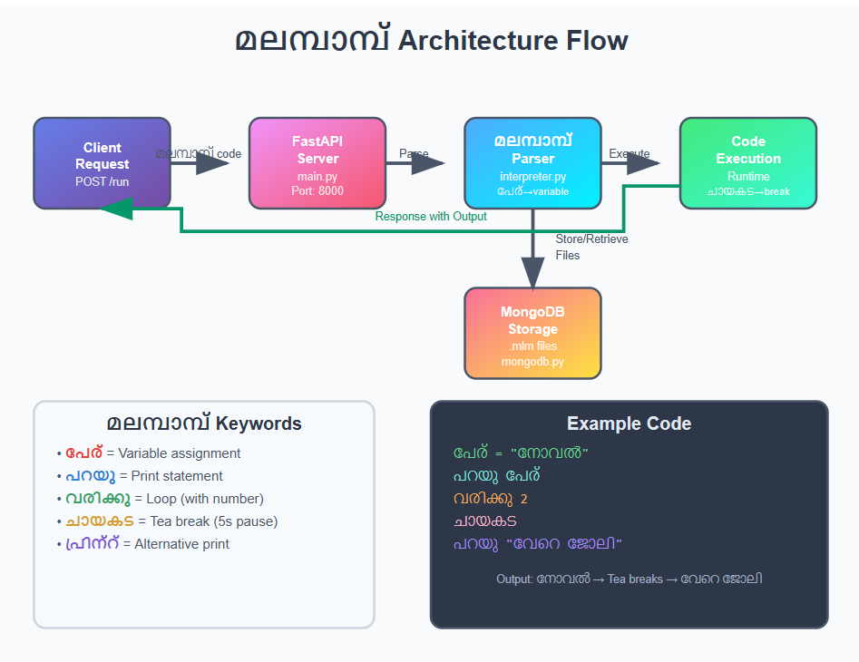

# മലമ്പാമ്പ് (Malampamp) Programming Language 🐍🎯

## Basic Details

### Team Name: The CodeFather

### Team Members

- Team Lead: Noel S Kocheekkaran - CUCEK
- Member 2: Shamil Niswan TKC - CUCEK

### Project Description

A revolutionary programming language called **മലമ്പാമ്പ്** that lets you code in Malayalam! Because why should English have all the fun? Now you can confuse your computer in your mother tongue while it pretends to understand what "ചായകട" means.

### The Problem (that doesn't exist)

Ever felt frustrated that you couldn't tell your computer "ചായ കുടിക്കുന്നു" and expect it to take a coffee break? Or wished you could write loops using "വരിക്കു" instead of boring old "for"? Well, neither did anyone else, but we solved it anyway!

### The Solution (that nobody asked for)

We created **മലമ്പാമ്പ്**, a Malayalam programming language interpreter that translates Malayalam keywords into actual code execution. Now you can write variables as "പേര്", print statements as "പറയു", and even make your program take tea breaks with "ചായകട"! It's like Google Translate met Python and decided to have a Malayalam baby with a really cool name.

## Technical Details

### Technologies/Components Used

For Software:

- **Languages used**: Python (FastAPI backend), React ( frontend)
- **Frameworks used**: FastAPI, Uvicorn
- **Libraries used**: MongoDB (for storage), Pydantic (data validation)
- **Tools used**: VS Code, Postman (for API testing), MongoDB Compass

For Hardware:

- Standard computer with internet connection

### Implementation

For Software:

# Installation

```bash
# Clone the repository
git clone https://github.com/Noel9907/useless2.0
cd useless2.0

# Install dependencies
pip install -r requirements.txt

# Run the server
uvicorn main:app --reload
```

### Project Documentation

For Software:

# Diagrams



## API Endpoints

### Execute മലമ്പാമ്പ് Code

```
POST http://127.0.0.1:8000/run
Body: {
  "mlm_code": "പേര് = \"നോവൽ\"\nപറയു പേര്\nവരിക്കു 2\nചായകട\nപറയു \"വേറെ ജോലി\""
}
```

### File Management

- `POST /files/create` - Create new മലമ്പാമ്പ് file
- `GET /files/:id` - Retrieve file by ID
- `PUT /files/:id` - Update file content
- `DELETE /files/:id` - Delete file
- `PATCH /files/:id/rename` - Rename file
- `GET /files` - List all files

### മലമ്പാമ്പ് Keywords

- `പേര്` = variable assignment
- `പറയു` = print statement
- `വരിക്കു` = loop (followed by number)
- `ചായകട` = tea break (5 second pause)
- `പ്രിന്റ്` = alternative print statement

### Project Demo

# Video

<p align="center">
  <a href="https://youtu.be/ihJyEw82o4Y">
  </a>
</p>

# Additional Demos

- Live coding session showing മലമ്പാമ്പ് code writing
- Demonstration of the tea break feature during loop execution
- File management system storing .mlm files in MongoDB

## Team Contributions

- **Noel S Kocheekkaran**: Backend development with FastAPI, മലമ്പാമ്പ് parser implementation, API endpoint design, MongoDB integration
- **Shamil Niswan TKC**: Frontend development (if applicable), testing, documentation, മലമ്പാമ്പ് keyword mapping, user experience design

---

Made with ❤️ at TinkerHub Useless Projects


## Fun Features

- **Tea Breaks**: Your code can literally take a chai break with `ചായകട`
- **Malayalam Variables**: Declare variables using `പേര്` instead of boring English
- **Cultural Loops**: Use `വരിക്കു` to create loops that feel more natural
- **File Storage**: Save your മലമ്പാമ്പ് masterpieces with `.mlm` extension
- **REST API**: Full CRUD operations for your മലമ്പാമ്പ് code files

_Disclaimer: This project may cause uncontrollable laughter, confusion among your developer friends, and an inexplicable urge to teach your grandmother how to code._
